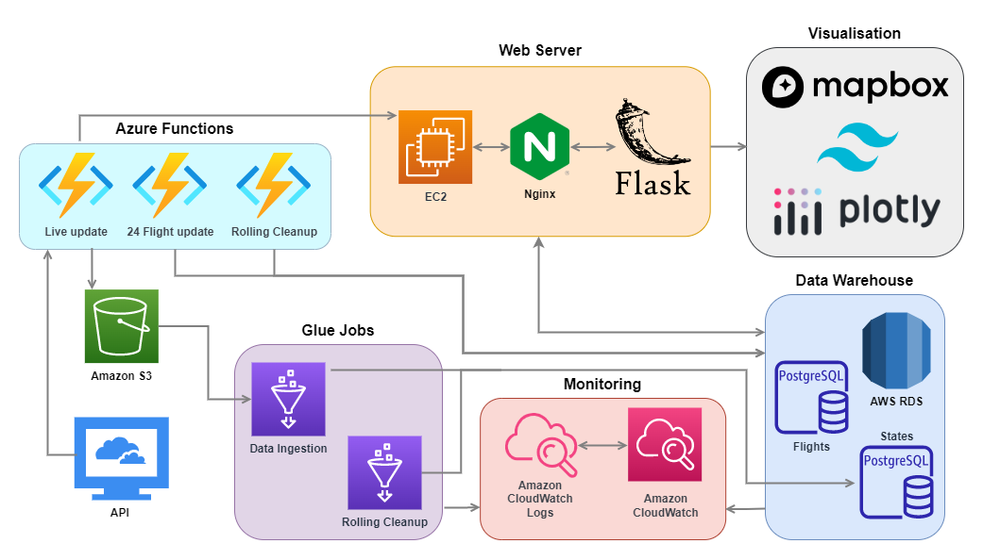

<!-- PROJECT SHIELDS -->
[![Contributors][contributors-shield]][contributors-url]
[![Forks][forks-shield]][forks-url]
[![Stargazers][stars-shield]][stars-url]
[![Issues][issues-shield]][issues-url]
[![MIT License][license-shield]][license-url]

<!-- PROJECT LOGO -->
 

  

<h3 align="center">OpenSky Visualisation</h3>

  

    Live aircraft tracker and analysis
     
    <a href="https://github.com/Data210/OpenSky-Dashboard"><strong>Explore the docs »</strong></a>
     
     
    <a href="https://github.com/Data210/OpenSky-Dashboard">View Demo</a>
    ·
    <a href="https://github.com/Data210/OpenSky-Dashboard/issues">Report Bug</a>
    ·
    <a href="https://github.com/gData210/OpenSky-Dashboard/issues">Request Feature</a>
  

<!-- TABLE OF CONTENTS -->

  
Table of Contents

  <ol>
    <li>
      <a href="#about-the-project">About The Project</a>
      <ul>
        <li><a href="#built-with">Built With</a></li>
      </ul>
    </li>
    <li><a href="#license">License</a></li>
    <li><a href="#contact">Contact</a></li>
    <li><a href="#acknowledgments">Acknowledgments</a></li>
  </ol>

<!-- ABOUT THE PROJECT -->
## About The Project

A full stack app for visualising bulk analytics and realtime reporting on open-source [OpenSky API](https://openskynetwork.github.io/opensky-api/rest.html) worldwide flight data.

[![Product Name Screen Shot][product-screenshot]](https://example.com)

<video src="https://github.com/Data210/OpenSky-Dashboard/blob/main/static/video/showcase_video.mp4" controls="controls" style="max-width: 730px;">
</video>

(<a href="#readme-top">back to top</a>)

### Built With
![Python][Python]
[![Flask][Flask]][Flask-url]
![Javascript][Javascript]
![jQuery][jQuery]
[![Tailwind][Tailwind]][tailwind-url]
[![AzureFunctions][AzureFunctions]][azure-url]
[![AWS][AWS]][aws-url]
[![Postgre][Postgre]][postgre-url]
![tmux][tmux]
![nginx][nginx]

(<a href="#readme-top">back to top</a>)

## System Diagram

<!-- LICENSE -->
## License

Distributed under the MIT License. See `LICENSE.txt` for more information.

(<a href="#readme-top">back to top</a>)

<!-- CONTACT -->
## Contact

Linkedin: [![Linkedin][linkedin-shield-andre]](https://www.linkedin.com/in/andre-m-r/)
[![LinkedIn][linkedin-shield-ethan]](https://www.linkedin.com/in/ethan-jolly/)

Project Link: [OpenSky Visualisation](https://github.com/Data210/OpenSky-Dashboard)

(<a href="#readme-top">back to top</a>)

<!-- ACKNOWLEDGMENTS -->
## Acknowledgments

* [OpenSky Network](https://opensky-network.org/) for their public API.

(<a href="#readme-top">back to top</a>)

<!-- MARKDOWN LINKS & IMAGES -->
<!-- https://www.markdownguide.org/basic-syntax/#reference-style-links -->
[contributors-shield]: https://img.shields.io/github/contributors/Data210/OpenSky-Dashboard.svg?style=for-the-badge
[contributors-url]: https://github.com/Data210/OpenSky-Dashboard/graphs/contributors
[forks-shield]: https://img.shields.io/github/forks/Data210/OpenSky-Dashboard.svg?style=for-the-badge
[forks-url]: https://github.com/Data210/OpenSky-Dashboard/network/members
[stars-shield]: https://img.shields.io/github/stars/Data210/OpenSky-Dashboard.svg?style=for-the-badge
[stars-url]: https://github.com/Data210/OpenSky-Dashboard/stargazers
[issues-shield]: https://img.shields.io/github/issues/Data210/OpenSky-Dashboard.svg?style=for-the-badge
[issues-url]: https://github.com/Data210/OpenSky-Dashboard/issues
[license-shield]: https://img.shields.io/github/license/Data210/OpenSky-Dashboard.svg?style=for-the-badge
[license-url]: https://github.com/Data210/OpenSky-Dashboard/blob/master/LICENSE.txt
[linkedin-shield-andre]: https://img.shields.io/badge/-Andre_M.R.-black.svg?style=for-the-badge&logo=linkedin&colorB=555
[linkedin-shield-ethan]: https://img.shields.io/badge/-Ethan_Jolly-black.svg?style=for-the-badge&logo=linkedin&colorB=555
[linkedin-url]: https://linkedin.com/in/linkedin_username
[product-screenshot]: static/img/screenshot.PNG
[Python]:https://img.shields.io/badge/python-3670A0?style=for-the-badge&logo=python&logoColor=ffdd54
[Javascript]: https://img.shields.io/badge/javascript-%23323330.svg?style=for-the-badge&logo=javascript&logoColor=%23F7DF1E
[Flask]: https://img.shields.io/badge/Flask-000000?style=for-the-badge&logo=flask&logoColor=white
[flask-url]: https://flask.palletsprojects.com/
[Tailwind]: https://img.shields.io/badge/Tailwind_CSS-38B2AC?style=for-the-badge&logo=tailwind-css&logoColor=white
[tailwind-url]: https://tailwindcss.com/
[AzureFunctions]: https://img.shields.io/badge/Azure_Functions-0062AD?style=for-the-badge&logo=azure-functions&logoColor=white
[azure-url]: https://azure.microsoft.com/en-gb
[AWS]: 	https://img.shields.io/badge/Amazon_AWS-FF9900?style=for-the-badge&logo=amazonaws&logoColor=white
[aws-url]: https://aws.amazon.com/
[Postgre]: https://img.shields.io/badge/PostgreSQL-316192?style=for-the-badge&logo=postgresql&logoColor=white
[postgre-url]: https://www.postgresql.org/
[jQuery]: https://img.shields.io/badge/jQuery-0769AD?style=for-the-badge&logo=jquery&logoColor=white
[tmux]: https://img.shields.io/badge/tmux-1BB91F?style=for-the-badge&logo=tmux&logoColor=white
[nginx]: https://img.shields.io/badge/nginx-%23009639.svg?style=for-the-badge&logo=nginx&logoColor=white
